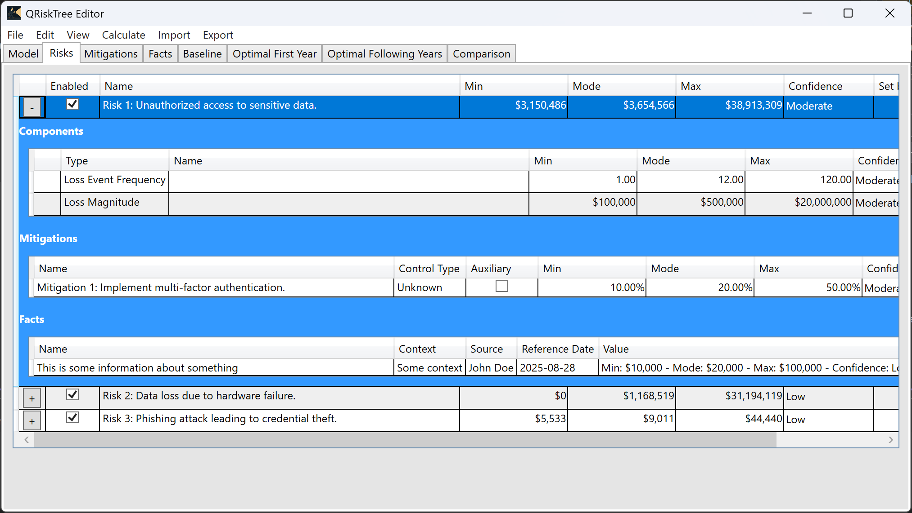
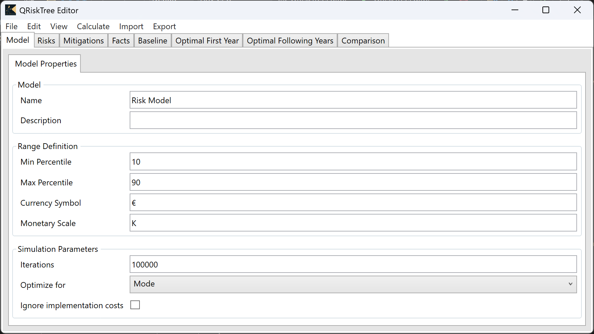
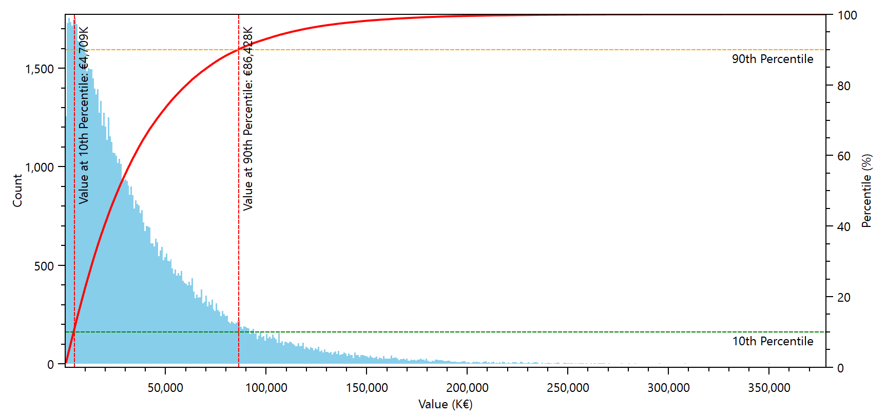
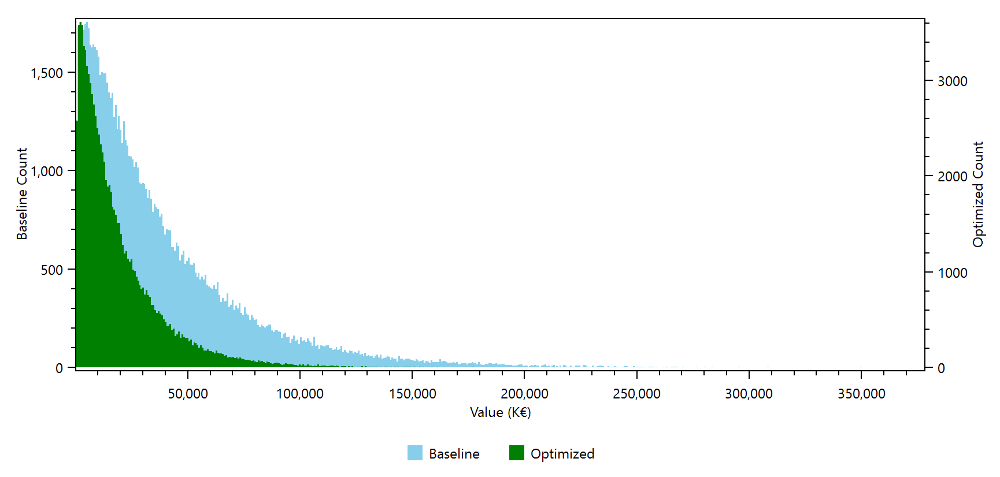
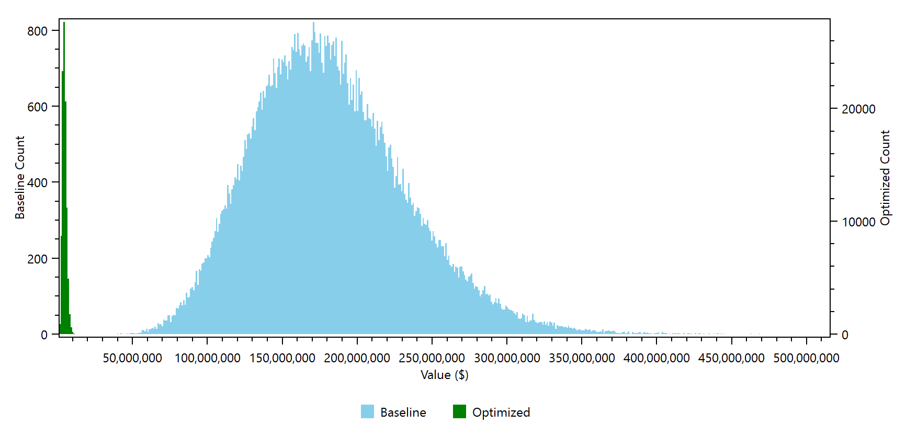

# QRiskTree
*Bridging Security and Business Decisions*

QRiskTree, short for Quantitative Risk Tree, is a library and a tool designed to help organizations determine when security is enough and which mitigations offer the best Return on the Security Investment. It enables data-driven decisions by combining threat modeling with quantitative risk analysis.

QRiskTree has been designed to address a serious gap in current threat modeling practices, but it can be applied to many other contexts. For example, it might prove beneficial to you if you need to:

- Evaluate the potential losses related to multiple uncorrelated risks which might happen during the year.
- Determine the most effective strategy to address multiple risks.
- Optimize your security investments for the next year.

QRiskTree aligns with the ideas described in:

- [Improving Return on Security Investment: Evaluating the Current Risk - The Open Group Blog](https://blog.opengroup.org/2024/03/20/improving-return-on-security-investment-evaluating-the-current-risk/)
- [Open FAIR and the ROI for Threat Modeling](https://www.threatmodelingconnect.com/events/open-fair-and-the-roi-for-threat-modeling)
- [Using Quantitative Analysis with System Threat Modeling Adopting Open FAIR™ Analysis with Threat Modeling to Maximize Return on Security Investment](https://publications.opengroup.org/w245)

> **IMPORTANT**
> The work implements a very personal take on the ideas introduced with the above material. It does not implement any specific standard or risk management framework. If you decide to use it as a tool to support your Compliance requirements, it is your responsibility to ensure that QRiskTree fits those requirements and aligns with your standards of reference, by eventually making the necessary changes to the code.

This is a project developed by a single person as a passion project, and is shared with you with the intent of providing the Security and Business communities a better way to communicate with each other and collaborate in creating better, more secure products.

With this intent of allowing the widest adoption, I've decided to provide QRiskTree under [MIT license](https://github.com/simonec73/QRiskTree?tab=MIT-1-ov-file#readme). You can use it for any lawful purpose, for free, including creating commercial software.

## What is QRiskTree composed of?

QRiskTree is first and foremost a library you can use in your own applications: [QRiskTree.Engine](https://github.com/simonec73/QRiskTree/tree/main/QRiskTree.Engine). This contains the core logic and is designed to be used as part of other applications.

Another component is [QRiskTreeEditor](https://github.com/simonec73/QRiskTree/tree/main/QRiskTree.Editor), a simple Windows Desktop application exposing QRiskTree functionalities.

The remaining projects, [QRiskTreeTest](https://github.com/simonec73/QRiskTree/tree/main/QRiskTreeTest) and [QRiskTreeParallelTest](https://github.com/simonec73/QRiskTree/tree/main/QRiskTreeParallelTest), are test applications respectively used to verify the main functionalities implemented by QRiskTree.Engine and how well it can execute multiple simulations and optimizations at the same time.

## How can I use QRiskTree?

The most immediate way to use QRiskTree is to simply use QRiskTreeEditor, but this is not the only way: QRiskTree.Engine is designed to be easily used in most applications. Here are some typical use cases.

### Interactive scripting

Do you want to use it to run scripts interactively? You can do that, for example using [LINQPad](https://www.linqpad.net/). Here is the receipt:

1. Open LINQPad and add QRiskTree.Engine.dll as a reference using **Reference and Properties** command from the **Query** menu. 
2. Insert the code you want to execute in the Query pane. You might take the code included in [Program.cs](https://github.com/simonec73/QRiskTree/blob/main/QRiskTreeTest/Program.cs) for testing purposes. You might need to make some simple adjustments, like removing the lines starting with **#region** and **#endregion**.
3. Change the **Language** to C# Statements and **.NET** to version 8.0.
4. Click on the **Run** button.

### Integrating within an application you own

Do you want to integrate it in your existing application? If it supports .NET 8.0, just add a reference to QRiskTree.Engine and you are good to go! If not, you might need to wrap it in some way, for example with a Web API.

You can also reuse some of the code provided with QRiskTreeEditor. For example, the View Models could be easily reused in a Web Application based on Blazor.

Starting from version 0.2.0 of the QRiskTree.Engine, you can host it in server applications shared among multiple users. This is because this version removes static variables which would have not allowed to configure the various models independently.

### Modifying it to fit your specific requirements

You are welcome to fork QRiskTree and make the changes that are required for you. Do you need to comply with a specific Quantitative Risk Analysis standard? Or integrate it with some Risk Management tool is in use by your Company? Feel free to do so. If you feel like the changes you have made might be of interest for the QRiskTree users community, please feel free to provide them to the main repo with a Pull Request (but I cannot guarantee they will be actually included), otherwise you are welcome to keep them for your own.

QRiskTree has been designed to be well structured and easily understandable. At least, I hope that it will be easily understandable. It currently lack comments, but that's a priority for the future.

## What are the requirements for QRiskTree Editor?

QRiskTree Editor requires a computer with Windows 10 x64 or Windows 11 and runs with minimal hardware. As of today, the QRiskTree library is single thread: this means that you might get better execution times with CPUs having better single-core performance.

QRiskTree Editor 0.3.0 on a computer based on AMD Ryzen 9 8945HS is able to optimize the [Big Model reference model](./Samples/Big%20model.json) with 10 risks defined at the Loss Event Frequency and Loss Magnitude level, and the same 10 mitigations assigned to every threat in about 2 minutes. The previous version, 0.2.0, took over 30 minutes for the same job. During the execution, the process has used around 350 to 550 MBytes of RAM (the previous version took around 250MBytes of RAM) and has fully used a little more than one core (around 7-8% of the CPU). As it is, the behavior is ideal for being incorporated in server applications serving multiple requests at the same time. Moreover, you can start an optimization job while you can safely continue to use your PC. For these reasons, I will not change it to support parallel execution of the simulation anytime soon. 

Note: this doesn't mean that you cannot execute multiple simulations on different models at the same time on server applications. You can do that since version 0.2.0. The above limitation is only related to a single model simulation: given that the model is a tree, you might execute the simulation splitting it on multiple threads, potentially cutting the time by executing multiple parallel sub-tasks. While possible, this is not a goal for this version of the QRiskTree Engine, as I want to prioritize the possibility to execute models on server applications shared by multiple users at the same time.

## Do you have some guidance on how to use QRiskTree Editor?

Please watch this video to get a quick introduction to QRiskTree Editor.

This guidance applies to version 0.2.0 and is still valid for version 0.3.0. With version 0.4.0, I've introduced some key changes, which augment but do not revolutionize the tool. You can find their detailed description below. The prefix ([0.4]) specifies when the feature has been introduced.

### [0.4] Control Types

It is now possible to specify the Control Type for Mitigations. There is a new property, called **Control Type** which can be edited in the **Mitigations** panel both in the table and in the properties. You can specify the following values. Preventive, Detective,  Corrective and Other. 

| Control Type | Description                                                  |
| ------------ | ------------------------------------------------------------ |
| Unknown      | This is the default value. It means that the Control Type has not been assigned. |
| Preventive   | Preventive controls reduce the probability and/or the impact of the risk. They are also known as Preventative. |
| Detective    | Detective controls are used to detect attack while they are in progress. As such, Detective controls have no direct effect on the potential losses, but they act as triggers for Corrective controls. See [Auxiliary Mitigations](#auxiliary-mitigations) for understanding how you should manage them. |
| Corrective   | Corrective controls have the intent of blocking attacks while they are in progress, to limit the potential losses. They are usually triggered by Detective controls, and include automated actions and manual processes, like those that are started by an email sent by some Alert. They are also known as Responsive. |
| Recovery     | Recovery controls are used to recover the system to its original state after a compromise. |
| Other        | This category is used to represent any other category of controls not included in the list. For example, a purely Deterrent control would be assigned to this category. |

Control Types are purely informative. Assigning a specific Control Type doesn't have any effect on the simulations.

### [0.4] Auxiliary Mitigations

Some controls have no direct effect on the residual risk. For example, purely Detective controls will only alert you for attacks in progress, but will do nothing about that. They are enablers for other controls, namely the Corrective ones. As such, they represent just a cost, as the effectiveness is given by the controls they enable.

This is where the new Auxiliary flag comes handy. If you mark a Mitigation assigned to a Risk as Auxiliary, using the specific check box shown in the window below, its effectiveness is not considered in the simulation.

Auxiliary mitigations are always considered as implemented. Therefore, they always affect the implementation and operation cost. This is because otherwise the optimization mechanism would never include them because they are not effective and only represent a cost.

You are not required to provide an estimation for the effectiveness of Auxiliary mitigations, as it is ignored. This means that you will not receive an error during the validation that is performed before the optimization activities.

### [0.4] Currency Symbol and Monetary Scale

Version 0.4 introduces the possibility to specify a different currency than the one set for your OS. It also allows you to specify the Monetary Scale, which can be empty or represent the scale like K for thousands, M for millions, B for billions and so on. All currency numbers are represented based on these parameters.

For example, with the configuration shown below, one hundred thousands will be represented as **€100,000K** on systems having comma as the thousands separator.

Changes to Currency Symbol and Monetary Scale are immediately effective and their value is stored in the model file. Please check the [Auxiliary example](./Samples/Auxiliary.json).

### [0.4] Charts

QRiskTree Editor now is able to create four charts as a result of the Calculations. The first shows the distribution of the Baseline, the second and third show the distribution of the combined costs for the optimal combination of mitigations related to respectively to the first and following years. These three charts are very similar to the following picture.

You can already notice that the chart shows the distribution of the samples, the percentile curve, highlighting the min and max percentiles chosen in the Properties (in this case, they are respectively the 10th and the 90th percentile). The left axis shows how many samples have been generated over the whole population (in this case, 100000). The right axis applies instead to the percentile curve, and shows a scale from 0 to 100. In the bottom axis, you can find the scale for the overall cost. You can get a lot of information from this chart: for example, you can determine that there is a 90% probability that the losses will be less than €86.4M for the system under scrutiny. Assuming that this chart refers to the Baseline, this number and the distribution give a very clear visual representation of the potential cost of the system considering the residual risk, if we do nothing.

The fourth and last chart, called **Comparison** provides a quick representation of the impact of the optimal mitigations on the total cost for security, which as already discussed includes the residual risk, and the implementation and operation costs for the mitigations.

The chart shows quite effectively how much you can save by implementing the selected mitigations. If the saving here doesn't look like much, you must consider that this includes the implementation and operation costs for the mitigations. Therefore, it represents real net savings.

Other models might produce even better results. Consider for example the [Big Model reference model](./Samples/Big%20model.json). This is what you can get by simulating it. Isn't that convincing?

These Comparison chart is slightly different from the other charts. First, the left and right axis apply respectively to the baseline distribution and to the optimized distribution. It is important to separate them otherwise the chart might not be readable: given that each distribution is obtained with the same number of samples, the optimized one tends to be much taller as it is more compressed. We also have a legend, which is missing from the other charts, to ensure you can quickly determine the meaning of each distribution.

## What are the improvements to QRiskTree Editor?

QRiskTree Editor has already had a few versions. Here are the key improvements for the most important releases, from the latest to the first.

- **0.4.0**: First major features improvement
  - Improved Mitigations management: Control Types and Auxiliary Mitigations.
  - Added the possibility to customize the currency: Currency Symbol and Monetary Scale.
  - Added Charts to improve the readability of the calculation results.

- **0.3.0**: Intelligent Caching
  - Major performance improvement. The [Big Model reference model](./Samples/Big%20model.json) is now about 15 times faster.
  - Improved consistency of the results.
- **0.2.0**: Parallel Execution
  - Added support for parallel execution.
  - Corrected the optimal ranges shown by the tool.
- **0.1.1**: Fixed minor bugs.
- **0.1.0**: First public version.

## Can I customize QRiskTree for my purposes?

Absolutely! Please Fork the QRiskTree repo and use the code as you see fit.

QRiskTree is developed using .NET 8.0. QRiskTree Editor is based on WPF. Both rely on third-party components that are free, Open Source and licensed with the same MIT license.

You should use the latest release of [Visual Studio 2022](https://visualstudio.microsoft.com/). The free Community edition is enough.

## Is QRiskTree supported?

No. It is provided as-is, with no guarantees of any sort.

## Is QRiskTree maintained?

In a sense, you can expect I will continue to update it for a while, but there is no guarantee I will maintain it in the future. It all depends on how much I will be able to use it myself.

When you get it, it might be a good idea to ensure at least that all references are updated and eventually recompile it.

## Is QRiskTree secure?

I am an Application Security expert and I try to write solutions that are as secure as possible and with no obvious vulnerabilities. I am scanning the code using [Security Code Scan](https://security-code-scan.github.io/), a free tool for scanning .NET code. I also rely on GitHub Dependabot and on GitHub Copilot to help identify vulnerabilities. Still, there is the possibility that there is some undetected vulnerability in the components I use, or in the code I write. Please treat my code with care, as you would normally do with every code written by a third party. As explained above, I do not provide any guarantee with my code, including about its security.

That said, I'm planning to prepare a short document describing its security characteristics and potential security issues.

## How can I contribute?

If you have any issue with it, please use the [Issues](https://github.com/simonec73/QRiskTree/issues) page to share it with me. You can also provide comments and desiderata in the [Discussions](https://github.com/simonec73/QRiskTree/discussions) page. And, of course, you can also provide proposals for code changes via [Pull Requests](https://github.com/simonec73/QRiskTree/pulls). I cannot guarantee that any of that will be followed up, but there is a good chance I will.
